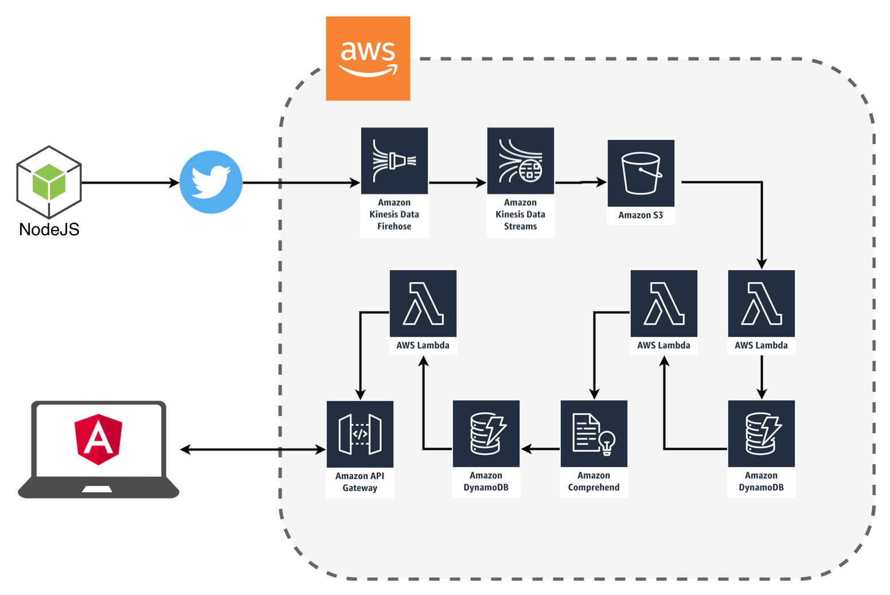

# Amazon Web Services (AWS) Challenge
Improve campus life using AWS artificial intelligence and machine learning services. Register for the AWS Challenge and explore AWS artificial intelligence and machine learning tools using computer vision natural language processing, speech recognition, text-to-speech, and machine translation. To qualify, use one or more of these AWS services: Amazon Comprehend, Amazon Transcribe, Amazon Polly, Amazon Lex, Amazon Translate, and Amazon Rekognition. Successful challengers will capitalize on AWS Lambda or Amazon SageMaker to turn their ideas into action. The winning project will earn awesome bragging rights by bringing something useful and original to campus life. [You can view the application here.](https://brocktubre.com/cuhackit)

This application uses several AWS severvices including S3, Lambda, DynamoDB, API Gateway, Kinesis Streams and Firehose, and AWS Comprehend. Below is an architectural diagram of how this service works.

1) A NodeJS application streams raw data into an S3 bucket by using Kinesis Streams and Kinesis Firehose (batches of files every 1 minute).
2) Once an object is put onto S3, it triggers a Lambda function. The Lambda function reads each objects and transforms the data so it can be inserted into a DynamoDB table (where the raw tweets are stored).
3) Every record that is added to the raw tweets DynamoDB table triggers another Lambda function to send the tweet to Amazon Comprehend where sentiment anaylsis is done. AWS Comprehend sends back a response wether the tweet was Postive, Netural, Negative, or Mixed. If the result was "NEGATIVE", another record is added to a seperate DynamoDB table (holding all the Negative repsonses from sentiment analysis). 
4) An API Gateway endpoint is setup to trigger another Lambda funciton to return all the values help withing the DynamoDB table hold the results from the sentiment analysis.

## About CUHackit2019
This challenege was part of Clemson's University event CUhackit 2019, held January 26th-27th. It is a student-led and run organization striving to provide the best hackathon experience possible. The event is welcome all hackers and creators to sign up and prepare to make something amazing!

### Some Screenshots

*Tweets*

## Links

Personal Website: https://brocktubre.com

Portfolio: https://brocktubre.com/portfolio

About Me: https://brocktubre.com/about

GitHub: https://github.com/brocktubre

LinkedIn: www.linkedin.com/in/brock-tubre-59954361

